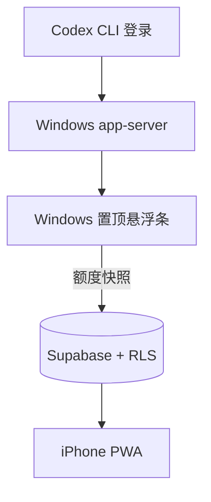

# 架构说明

## 数据流

1. Windows 程序启动 `codex app-server` 的标准输入输出协议。
2. 完成 `initialize` / `initialized` 握手。
3. 调用 `account/rateLimits/read`，并监听 `account/rateLimits/updated`。
4. 将额度数据规范化为 `buckets[]`、`updatedAt` 和 `planType`。
5. 用户登录同步账户后，以自己的 `auth.uid()` 向 `quota_snapshots` 执行 upsert。
6. iPhone PWA 使用同一账户查询自己的单行额度快照。

## 信任边界

| 区域 | 持有的数据 | 不持有的数据 |
|---|---|---|
| Windows Codex 进程 | Codex 自身登录状态 | Supabase 高权限密钥 |
| Windows 桌面程序 | 额度、Publishable key、加密同步会话 | ChatGPT 密码、聊天内容 |
| Supabase | 每位用户的最新额度快照 | Codex OAuth token、项目文件 |
| iPhone PWA | Publishable key、自己的同步会话和额度 | Codex 登录凭据、其他用户额度 |

## 为什么不直接让 iPhone 登录 Codex

官方额度读取接口由本机 Codex `app-server` 提供。iOS 不能运行 Codex CLI，也不应复制 Windows 上的 ChatGPT OAuth token，因此使用最小化云端快照中转。

